## AI的起源

### AI的历史

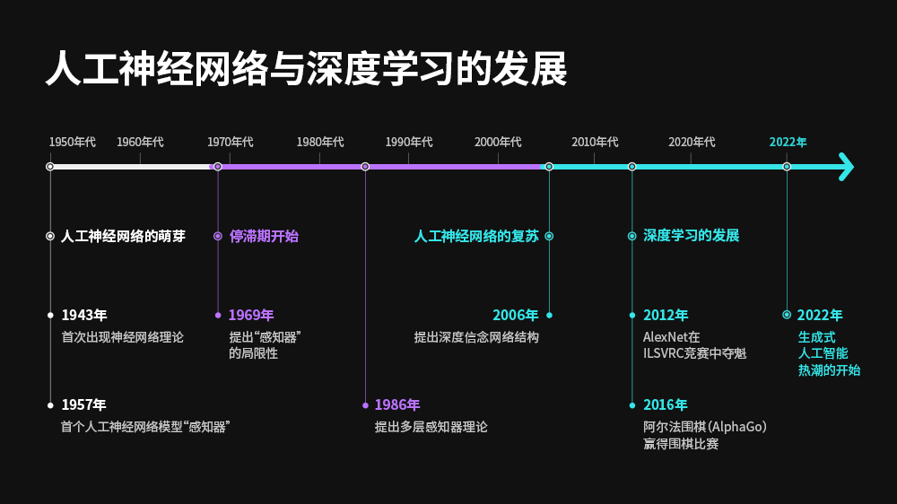

自 1950 年代人工智能概念提出后，人工神经网络开始萌芽，1943 年出现神经网络理论，1957 年提出感知器模型，但后续因计算力和理论不足进入停滞期，1969 年感知器局限性被提出，直到 1986 年多层感知器理论出现。1990 年代 - 2000 年代，人工智能走向应用，专家系统和机器学习（尤其是神经网络）推动其发展，2006 年深度信念网络结构被提出，20 世纪 90 年代 - 2010 年人工智能平稳发展，研究重心逐渐转向机器学习。


2010 年代 - 2020 年代，大数据等信息技术发展推动深度学习飞速进步，2012 年 AlexNet 夺冠、2016 年阿尔法围棋赢得比赛，人工智能技术迎来爆发。2020 年代至今，生成式人工智能崛起，2022 年在多领域取得成果，如 GPT - 3、GPT - 4 等大型语言模型以及扩散模型，推动各行业变革，使人工智能进入新阶段。

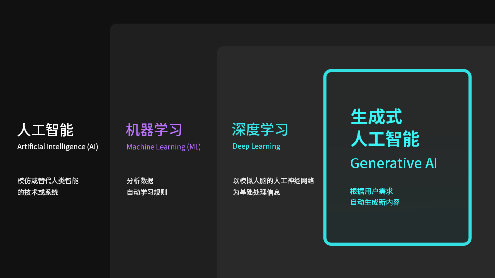


## 常见的深度学习的方向

在深度学习领域，**CV（Computer Vision，计算机视觉）和NLP（Natural Language Processing，自然语言处理）** 是两大核心方向，分别专注于处理图像/视频数据和文本/语言数据。

### CV（计算机视觉）方向

计算机视觉旨在让机器具备理解和处理视觉信息的能力，主要涉及图像、视频等多媒体数据的分析和生成。

#### 主要研究方向

+ 图像分类（Image Classification）：识别图像中主体的类别，例如猫、狗、汽车等。
+ 目标检测（Object Detection）：在图像中定位并标注特定目标（如YOLO、Faster R-CNN）。
+ 图像分割（Image Segmentation）：将图像按像素级别划分区域，分为语义分割（Semantic Segmentation）和实例分割（Instance Segmentation）。
+ 姿态估计（Pose Estimation）：识别人体或物体的关键点，常用于动作捕捉、行为分析。
+ 图像生成（Image Generation）：生成逼真的图像，涉及GAN（生成对抗网络）、扩散模型（Stable Diffusion）。


#### 可视化演示

https://adamharley.com/nn_vis/cnn/3d.html

###  NLP（自然语言处理）方向

自然语言处理旨在使机器理解、生成和处理人类语言，涉及文本、语音数据的分析与生成。

#### 主要研究方向

+ 文本分类（Text Classification）：对文本按类别进行分类（如情感分析、垃圾邮件识别）。
+ 机器翻译（Machine Translation）：自动将一种语言翻译为另一种语言（如Google Translate）。
+ 信息抽取（Information Extraction）：从文本中提取关键信息，如命名实体识别（NER）、关系抽取。
+ 文本生成（Text Generation）：生成符合语境的自然语言文本（如对话生成、文章写作）。
+ 语音识别与合成（ASR & TTS）：将语音转换为文本（如Siri），或将文本转换为语音（如语音助手）。


##### 可视化演示

https://poloclub.github.io/transformer-explainer/

### 交叉领域

+ OCR（Optical Character Recognition）：能够自动识别图像、扫描文档、照片或其他视觉媒介中的文字，并将其转换为计算机可编辑、搜索和处理的文本格式。
+ 多模态大模型（Multimodal Large Models, MLLMs）：能够理解和生成多种形式数据（如文本、图像、音频、视频、3D模型等）的深度学习模型。
+ 文字搜索图片（Text-to-Image Retrieval）是一项多模态检索任务，旨在根据文本描述，从大量图片中找到与之语义匹配的图像。这项技术广泛应用于电商、社交媒体、搜索引擎、数字资产管理等领域。
+ ...

## LLM（大语言模型）

通常是具有大规模参数和计算能力的自然语言处理模型，例如 OpenAI 的 GPT-3 模型。这些模型可以通过大量的数据和参数进行训练，以生成人类类似的文本或回答自然语言的问题。大型语言模型在自然语言处理、文本生成和智能对话等领域有广泛应用。

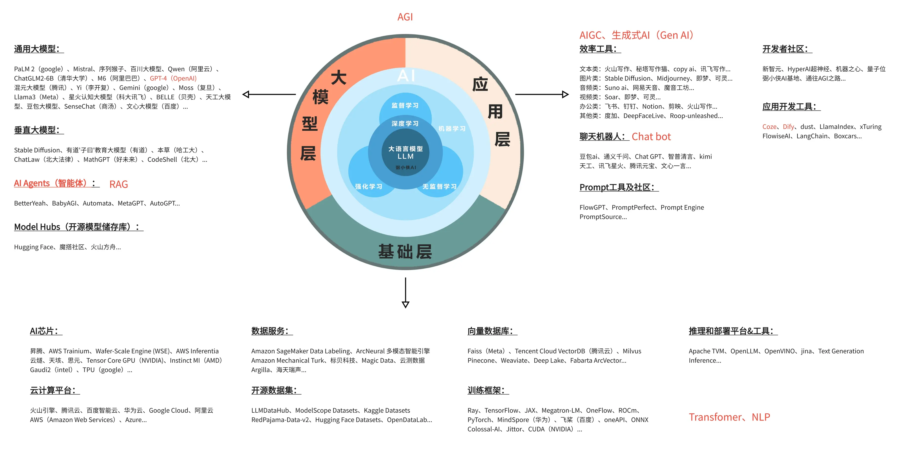


### LLM在工作中的运用

#### 写代码：


1. Cursor：基于AI的代码编辑器，类似VSCode，适合个人开发者或产品经理。

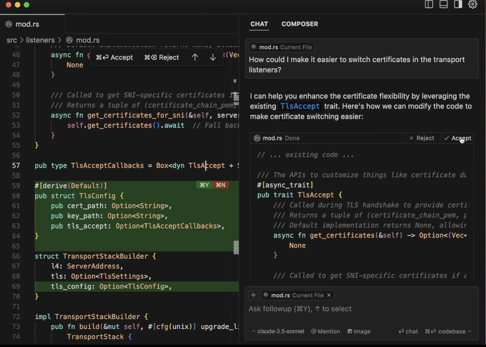

2. GitHub Copilot：AI代码助手，适用于企业级开发，提高编程效率。

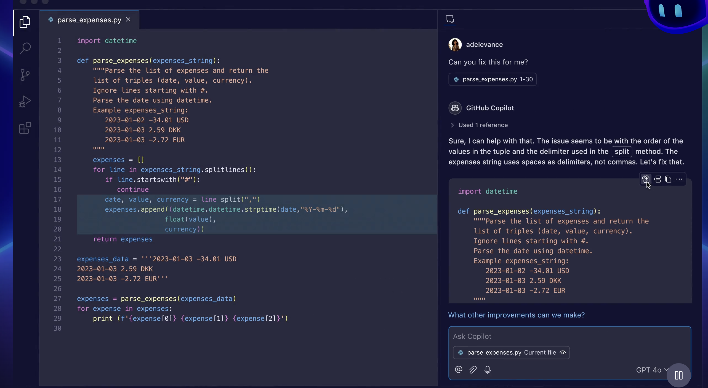

3. Continue：Continue 是一款VSCode 和JetBrains 插件，它本身不提供AI 模型，但它提供了多种接入AI 模型的方法来实现多种场景下的功能

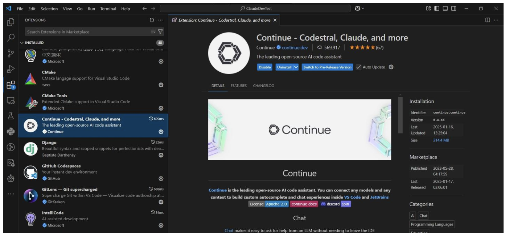

#### 做PPT：

1. Gamma：AI生成PPT，强调创意和协作，适合内容创作者。

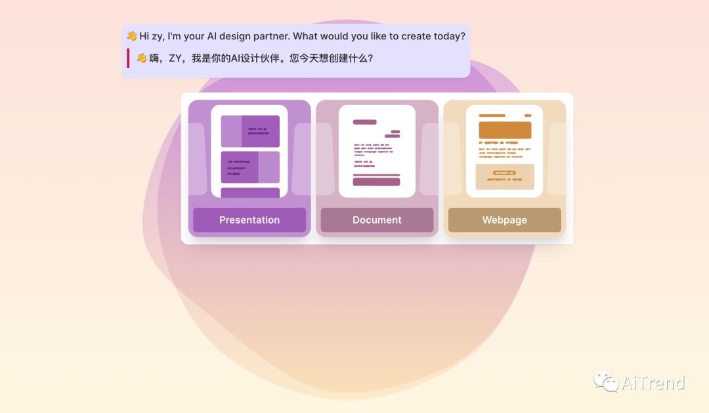

2. AiPPT：基于模板的PPT生成工具，适合需要快速出成果的场景。

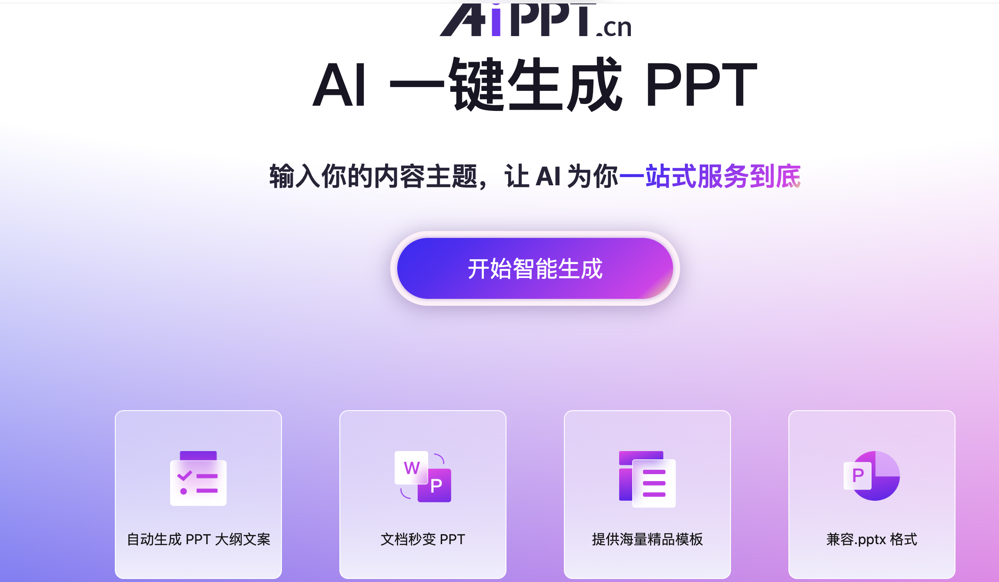

#### 生成视频：

1. 可灵（快手）：AI视频生成工具，符合国内用户需求，细节丰富，适合各类视频创作。


#### 智能体（AI助手）：

1. Coze（字节跳动）：零代码AI Bot开发平台，支持插件和工作流，适合非技术人员打造个人智能助手。


#### 写专业/学术文章：

1. 秘塔AI搜索：提供准确来源，避免AI幻觉，适用于学术和专业领域，优于传统搜索。


### 相关基础知识

#### 根据模型参数来计算所用显存

1. 1B"的全称是"1 Billion"，表示十亿
2. 目前模型的参数绝大多数都是float32类型, 占用4个字节。所以一个粗略的计算方法就是，每10亿个参数，占用4G显存(实际应该是10^9*4/1024/1024/1024=3.725G，为了方便可以记为4G)。
3. 1B模型参数对应多少G内存和参数的精度有关，如果是全精度训练（fp32），一个参数对应32比特，也就是4个字节，参数换算到显存的时候要乘4，也就是1B模型参数对应4G显存，如果是fp16或者bf16就是乘2，1B模型参数对应2G显存。

| 训练精度      | 每1B（10亿参数）需要占用内存 |
| ------      | ------   |
| float32     |    4G    |
| fp16/bf16   |    2G    |
| int8        |    1G    | 
| int4        |    0.5G  |

#### Token计算

在自然语言处理中，一个 Token 通常指一个有意义的文本片段。大模型在处理文本时，会将输入的句子拆分成一个个 Token。不同模型可能采用各自的切分方法，因此，一个 Token 所对应的汉字数量也会有所不同。如腾讯1token≈1.8个汉字，通义千问、千帆大模型等1token=1个汉字，OpenAI中1000个token通常代表750个英文单词或500个汉字。1 个token大约为 4 个字符或 0.75 个单词。对于英文文本来说，1个token通常对应3至4个字母， 不同的模型对相同的输入分词， 分词结果是不一样的。

+ OpenAI官方的token计算工具 : https://platform.openai.com/tokenizer

#### 常见显卡算力

| **特性**   | **FP32 (单精度)** | **FP16 (半精度)**    |
| -------- | -------------- | ----------------- |
| **位宽**   | 32位            | 16位               |
| **精度**   | 高（适用于精确计算）     | 低（适用于快速计算）        |
| **计算速度** | 较慢             | 更快（通常是FP32的2倍或更多） |
| **适用场景** | 科学计算、复杂模型训练    | AI推理、深度学习加速       |
| **消耗资源** | 占用更多显存，功耗更高    | 占用更少显存，功耗更低       |
| **性能指标** | TFLOPS (FP32)  | TFLOPS (FP16)     |

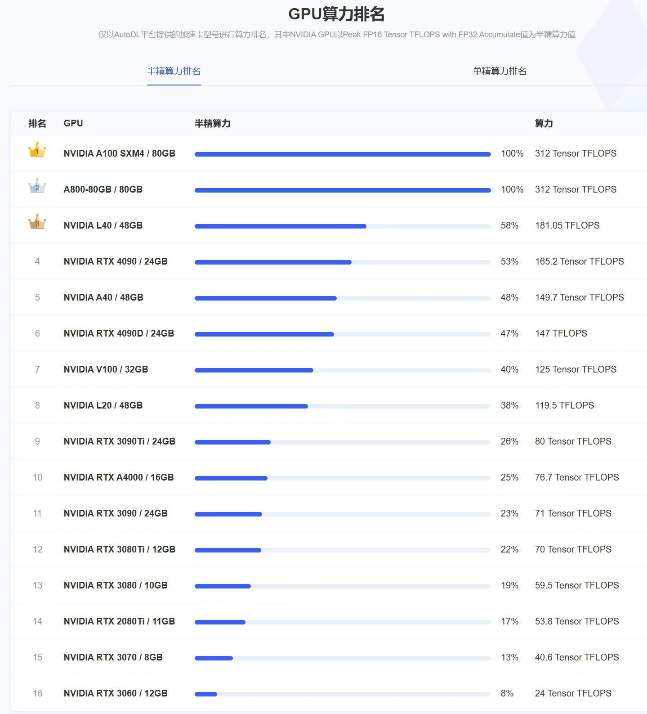

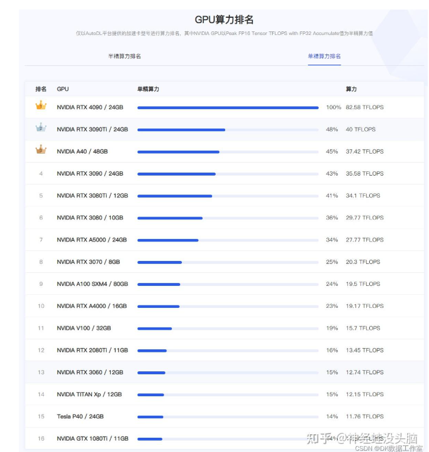


#### 大模型蒸馏

LLM 蒸馏 (Distillation) 是一种技术，用于将大型语言模型 (LLM) 的知识转移到较小的模型中。其主要目的是在保持模型性能的同时，减少模型的大小和计算资源需求。通过蒸馏技术，较小的模型可以在推理时更高效地运行，适用于资源受限的环境。

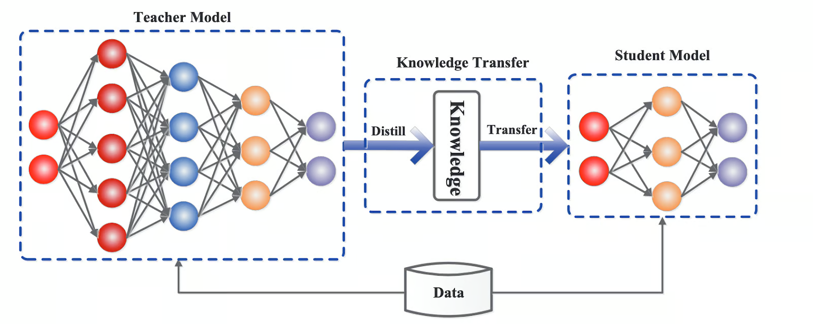

##### 蒸馏过程

+ 训练教师模型：首先训练一个大型且性能优越的教师模型。
+ 生成软标签：使用教师模型对训练数据进行预测，生成软目标 (soft targets) ，这些目标包含了教师模型的概率分布信息。
+ 训练学生模型：使用软目标 (soft targets) 和原始训练数据 (hard targets) 来训练较小的学生模型，使其能够模仿教师模型的行为。 这种方法不仅可以提高模型的效率，还可以在某些情况下提高模型的泛化能力。


##### 蒸馏的优点

+ 减少模型大小和计算资源需求
+ 增加推理速度
+ 易于访问和部署

##### 蒸馏可能存在的问题

+ 信息丢失：由于学生模型比教师模型小，可能无法完全捕捉教师模型的所有知识和细节，导致信息丢失。
+ 依赖教师模型：学生模型的性能高度依赖于教师模型的质量，如果教师模型本身存在偏差或错误，学生模型可能会继承这些问题。
+ 适用性限制：蒸馏技术可能不适用于所有类型的模型或任务，尤其是那些需要高精度和复杂推理的任务。


#### 大模型量化

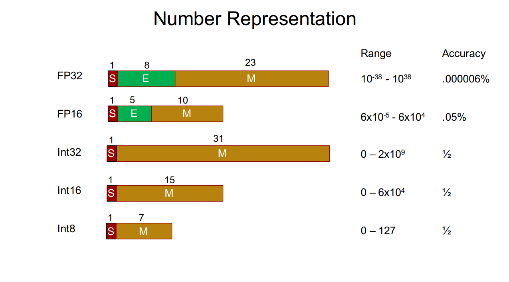

量化 (Quantization) 是一种通过降低模型参数的数值精度来压缩模型大小的技术. 在深度学习中, 模型参数通常以32位浮点数 (FP32) 存储, 通过量化可以将其转换为更低精度的表示形式, 从而减少模型的内存占用和计算开销.

如图, FP32 的大小是 4 字节 (每个字节8bit, 4字节 * 8bit = 32bit), 而 FP16 的大小是 2 字节 (每个字节8bit, 2字节 * 8bit = 16bit).

这也是为什么大家喜欢用 Q4 量化模型的原因, 跟 FP16 (16bit) 的模型相比, Q4 (4bit) 的模型只有 1/4 的大小. 运行起来需要的内存也是1/4.

现在大多数模型训练都采用 FP16 的精度, 最近出圈的 DeepSeek-V3 采用了 FP8 精度训练, 能显著提升训练速度和降低硬件成本.

#### 大模型命名规则
1. 样例解释：
+ 模型名称
Donnyeed/DeepSeek-R1-Distill-Qwen-32B-Q4_K_M-GGUF
+  通用公式
作者/机构 + 模型系列 + 训练方式 + 基座架构 + 参数量 + 量化等级 + 文件格式
+ 字段解释
    + [Donnyeed/] → 模型作者/团队（如 GitHub 用户名）
    + [DeepSeek-R1] → 基础模型家族 + 版本号，其中R 表示推理（reasoning）
    + [Distill] → 训练方式（蒸馏版，体积更小）
    + [Qwen] → 基座模型架构（阿里千问架构）
    + [32B] → 参数量级（320 亿参数，B = billion）
    + [Q4_K_M] → 量化等级（4bit 压缩，平衡精度与速度），这种命名方式一般是 GGUF & GGML 格式的模型. 他们通常采用 K 量化模型, 格式类似 Q4_K_M, 这里的 Q 后面的数字代表量化精度, K 代表 K 量化方法, M 代表模型在尺寸和 PPL (Perplexity, 困惑度) 之间的平衡度, 有 0, 1, XS, S, M, L 等.常见 K 量化版本的PPL对比 (这是一个7B模型):
    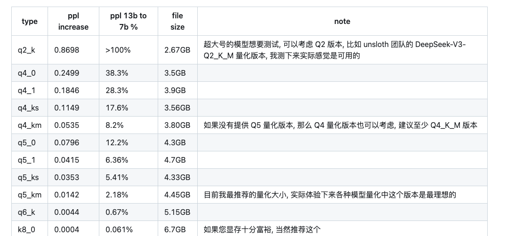
    + [GGUF] → LLM 量化方法之（llama.cpp 推出的新格式），类似的还有AWQ，GPTQ
2. 设备选择
+ 手机/笔记本 → 选 7B/13B 参数 + Q4/Q5 量化
+ 高端显卡 → 试 32B/70B + Q8/Q8_K
+ GGUF → 适配 llama.cpp
+ AWQ，GPTQ → 适配 vLLM 框架
+ FP16 → 需大显存


#### 常见开源大模型

##### DeepSeek系列

1. DeepSeek V3

DeepSeek-V3 为自研 MoE 模型，671B 参数，激活 37B，在 14.8T token 上进行了预训练。

2. DeepSeek-R1系列

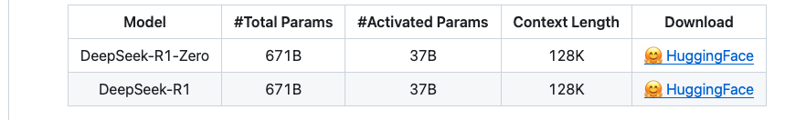
DeepSeek-R1 有DeepSeek-R1和DeepSeek-R1-Zero两个版本， DeepSeek-R1-Zero 是一种通过大规模强化学习 (RL) 训练的模型，无需监督微调 (SFT) 作为初步步骤，在推理方面表现出色。 然而，DeepSeek-R1-Zero 面临着诸如无休止重复、可读性差和语言混合等挑战， DeepSeek-R1，它在 RL 之前整合了冷启动数据。DeepSeek-R1 在数学、代码和推理任务中实现了与 OpenAI-o1 相当的性能。

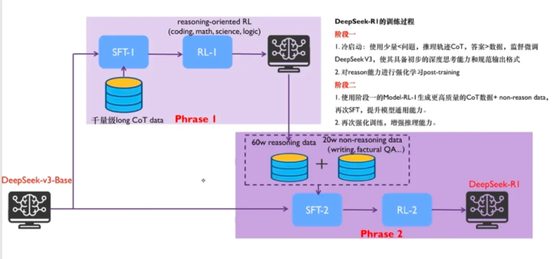


3. DeepSeek-R1-Distill系列

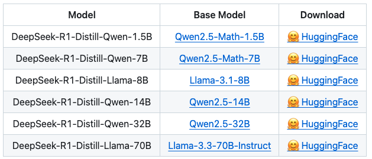

使用 R1 训练过程中生成的 60w 推理相关的数据，以及 20w 的额外数据去对小模型做 监督式微调，小模型性能的提升非常明显。基于开源模型（如 Qwen2.5 和 Llama 系列）经过知识蒸馏与强化学习优化得到。参数范围从 1.5B、7B、8B、14B、32B 到 70B，各自均在保持较高推理能力的同时大幅降低了运行资源需求，适用于大多数商业化和中小型科研任务。


4. 不同模型使用场景选择

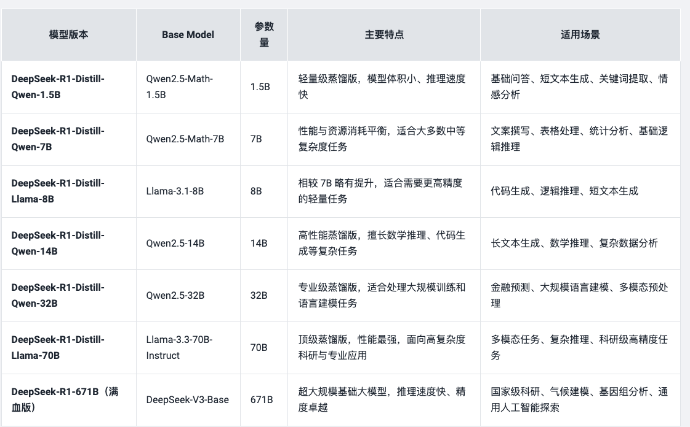


### 提示词工程

提示工程（Prompt Engineering）是一门较新的学科，关注提示词开发和优化，帮助用户将大语言模型（Large Language Model, LLM）用于各场景和研究领域。 掌握了提示工程相关技能将有助于用户更好地了解大型语言模型的能力和局限性。

#### 指令清楚
1. 问题里包含更多细节。

在向ChatGPT提问的时候，要在问题里，包含相关的、重要的细节。 否则的话，ChatGPT就会给你瞎猜。
+ 示例：
```
不好的提示词： 总结会议记录。 
更好的提示词： 将会议记录总结成一个段落。然后编写演讲者的Markdown列表及其要点。最后，列出演讲者建议的下一步行动或行动项目（如果有）。
```
2. 让模型角色扮演

可用于指定模型在回复中使用的人设,可以让回答的效果更好

+ 示例：
```
不好的提示词： 如何控制消极情绪？ 
更好的提示词： 我想让你担任心理健康顾问。我将为您提供一个寻求指导和建议的人，以管理他们的情绪、压力、焦虑和其他心理健康问题。您应该利用您的认知行为疗法、冥想技巧、正念练习和其他治疗方法的知识来制定个人可以实施的策略，以改善他们的整体健康状况。 我的第一个请求是“如何控制消极情绪？”
```
3. 使用分隔符

使用三重引号、XML标签、章节标题等分隔符可以帮助划分文本的不同部分，便于ChatGPT更好地理解，以便进行不同的处理。常见的分隔符有： 三引号,xml标记,对于简单的内容，有分隔符和没有分隔符，得到的结果，可能差别不大。但是，任务越复杂，消除任务的歧义就越重要。
+ 示例1：
```
将三引号中的古诗翻译成现代汉语。
 """ 关关雎鸠，在河之洲。 窈窕淑女，君子好逑。 参差荇菜，左右流之。 窈窕淑女，寤寐求之。 求之不得，寤寐思服。 悠哉悠哉，辗转反侧。 参差荇菜，左右采之。 窈窕淑女，琴瑟友之。 参差荇菜，左右芼之。 窈窕淑女，钟鼓乐之。 """
```
+ 示例2:
```
您将获得一对关于同一主题的文章（用 XML 标记分隔）。

先总结一下每篇文章的论点。

然后指出他们中的哪一个提出了更好的论点并解释原因。

<article> 在这里插入第一篇文章</article> 
<article> 在这里插入第二篇文章</article>
```
4. 指定完成任务所需的步骤

有些任务最好指定为一系列步骤。明确地写出步骤可以使模型更容易遵循它们。

+ 示例：

```
使用以下分步说明响应用户输入。
 第 1 步 - 用户将用三重引号为您提供文本。在一个句子中总结这段文字，并加上一个前缀“Summary:”。 
 第 2 步 - 将第 1 步中的摘要翻译成西班牙语，并加上前缀“Translation:”。 
 """在此插入文本"""
```
#### 零样本提示
是指在没有提供任何具体示例的情况下，通过自然语言提示让大语言模型（LLM）执行特定任务的方法。也就是说，你只需通过明确的指令描述要完成的任务，模型就能够基于自身的训练知识来理解并完成任务，而无需提供额外的训练示例或参考答案，相关示例如下所示：

```
提示：

将文本分类为中性、负面或正面。
文本：我认为这次假期还可以。
情感：

输出：

中性
```

#### 少样本提示

虽然大型语言模型展示了惊人的零样本能力，但在使用零样本设置时，它们在更复杂的任务上仍然表现不佳。少样本提示可以作为一种技术，以启用上下文学习，我们在提示中提供演示以引导模型实现更好的性能。

+ 输入：
```
“whatpu”是坦桑尼亚的一种小型毛茸茸的动物。一个使用whatpu这个词的句子的例子是：
我们在非洲旅行时看到了这些非常可爱的whatpus。
“farduddle”是指快速跳上跳下。一个使用farduddle这个词的句子的例子是：
```

+ 输出：
```
当我们赢得比赛时，我们都开始庆祝跳跃。

```

#### 链式思考（CoT）提示

核心思想是引导模型按照逻辑步骤逐步推理，而不是直接生成答案。通过在提示中加入详细的思维链（中间推理过程），模型可以更好地解决需要复杂推理、数学计算、常识推理等任务。

1. 链式思考（CoT）提示

+ 输入：
```
这组数中的奇数加起来是偶数：4、8、9、15、12、2、1。
A：将所有奇数相加（9、15、1）得到25。答案为False。
这组数中的奇数加起来是偶数：17、10、19、4、8、12、24。
A：将所有奇数相加（17、19）得到36。答案为True。
这组数中的奇数加起来是偶数：16、11、14、4、8、13、24。
A：将所有奇数相加（11、13）得到24。答案为True。
这组数中的奇数加起来是偶数：17、9、10、12、13、4、2。
A：将所有奇数相加（17、9、13）得到39。答案为False。
这组数中的奇数加起来是偶数：15、32、5、13、82、7、1。
A：
```

+ 输出：
```
将所有奇数相加（15、5、13、7、1）得到41。答案为False。
```

2. 零样本 COT 提示

零样本 CoT 提示是一种提示工程技术，结合了零样本提示和链式思考提示的优势。其核心思想是通过在提示中添加简单的思维引导指令，如**“请一步步思考”**，来鼓励模型自主展开推理过程，即使没有提供任何示例，也能处理复杂的多步推理任务。

+ 输入：
```
我去市场买了10个苹果。我给了邻居2个苹果和修理工2个苹果。然后我去买了5个苹果并吃了1个。我还剩下多少苹果？
让我们逐步思考。
```
+ 输出：
```
首先，您从10个苹果开始。
您给了邻居和修理工各2个苹果，所以您还剩下6个苹果。
然后您买了5个苹果，所以现在您有11个苹果。
最后，您吃了1个苹果，所以您还剩下10个苹果。
```

3. 自动思维链（Auto-CoT）

它通过自动生成少样本链式思考（Few-Shot CoT）示例，使大语言模型能够有效地学习如何进行多步推理，而无需手动构建大量示例。

Auto-CoT 主要由两个阶段组成：

阶段1：问题聚类：将给定问题划分为几个聚类

阶段2：演示抽样：从每组数组中选择一个具有代表性的问题，并使用带有简单启发式的 Zero-Shot-CoT 生成其推理链


```

1. 挑选问题：

Q1: 小明有 15 个苹果，给了小红 7 个，给了小刚 4 个。小明还剩多少个苹果？

2. 模型生成思维链

思考过程：
1. 小明一共有 15 个苹果。
2. 他给了小红 7 个，剩下 15 - 7 = 8 个。
3. 他又给了小刚 4 个，剩下 8 - 4 = 4 个。
答案是 4 个苹果。

3. 构建提示模板（用于增强模型解决其他类似问题的能力）：

示例：
Q1: 小明有 15 个苹果，给了小红 7 个，给了小刚 4 个。小明还剩多少个苹果？
思考过程：
1. 小明一共有 15 个苹果。
2. 他给了小红 7 个，剩下 15 - 7 = 8 个。
3. 他又给了小刚 4 个，剩下 8 - 4 = 4 个。
答案是 4 个苹果。

Q2: 小李有 20 支铅笔，借给小王 9 支，借给小赵 5 支。他还剩多少支铅笔？

4. 增强推理能力（模型用此提示回答新问题）：

思考过程：
1. 小李一共有 20 支铅笔。
2. 借给小王 9 支，剩下 20 - 9 = 11 支。
3. 借给小赵 5 支，剩下 11 - 5 = 6 支。
答案是 6 支铅笔。

```


#### 自我一致性

通过引导模型生成多种不同的推理路径，然后使用投票或统计的方式，选出最一致的答案，从而提高模型的准确性和稳定性。

```
小明有 25 个苹果，给了小红 8 个，给了小刚 6 个。小明还剩多少个苹果？请一步步思考并给出答案。

模型执行过程： 模型多次生成推理路径：

路径 1：

小明有 25 个苹果。
给了小红 8 个，剩下 25 - 8 = 17 个。
给了小刚 6 个，剩下 17 - 6 = 11 个。 答案：11 个苹果。

路径 2：

小明有 25 个苹果。
给了小红 8 个，剩下 25 - 8 = 17 个。
给了小刚 6 个，剩下 17 - 6 = 11 个。 答案：11 个苹果。

路径 3（可能错误路径）：

小明有 25 个苹果。
他给了 8 个和 6 个，总共 8 + 6 = 14 个。
剩下 25 - 14 = 9 个。 答案：9 个苹果。

答案统计与投票：

答案 "11 个苹果" 出现 2 次
答案 "9 个苹果" 出现 1 次

最终答案：

根据多数投票，答案是：11 个苹果。

```

#### 生成知识提示

生成知识提示 (Knowledge Generation Prompting) 是一种提升大语言模型在复杂推理、知识密集型任务中的表现的提示策略。它的核心思想是在模型执行最终任务前，先引导模型生成与问题相关的背景知识或中间信息，然后再基于这些知识做出推理或回答。

```
问题：为什么天空是蓝色的？

1. 提示模型生成相关知识：

请列出与“为什么天空是蓝色的”相关的科学知识：

模型输出：

- 光由多种颜色组成，形成可见光谱。
- 当阳光进入地球大气层时，短波长的光（如蓝光）比长波长的光（如红光）更容易被散射。
- 瑞利散射效应解释了光在大气中的散射行为。

结合知识回答问题：

根据以上知识，解释为什么天空是蓝色的。

模型输出：

由于瑞利散射效应，阳光中的短波长光（蓝光）比长波长光（红光）更容易被地球大气散射。因此，当阳光穿过大气层时，更多的蓝光向各个方向散射，使得我们从地面看到天空呈现蓝色。

```

### 垂直领域大模型

垂直领域大模型是指专门针对某个特定行业或专业领域进行训练和优化的大语言模型（LLM）。相较于通用大模型（如 GPT 系列、Gemini、Claude 等），垂直领域大模型在特定领域的数据、知识和任务上具有更强的理解、推理和生成能力，能够提供更精准和专业的服务。当前垂直领域大模型主要是通过对模型的微调和基于检索增强的生成(Retrieval Augmented Generation , RAG)两种方式来完成在特定领域内的任务


#### 模型微调

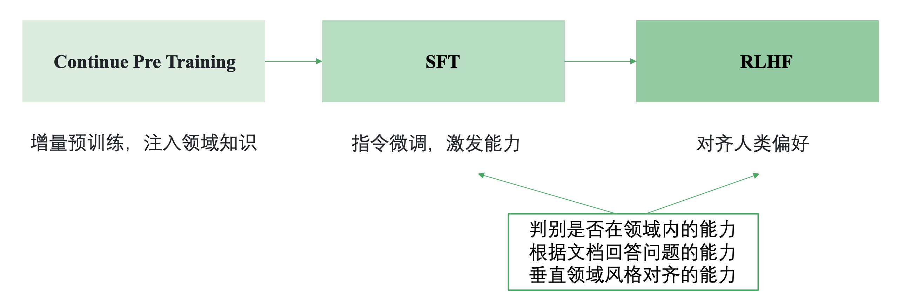

+ Continue PreTraining: 一般垂直大模型是基于通用大模型进行二次的开发。为了给模型注入领域知识，就需要用领域内的语料进行继续的预训练。
+ SFT: 通过SFT可以激发大模型理解领域内各种问题并进行回答的能力(在有召回知识的基础上)。
+ RLHF: 通过RLHF可以让大模型的回答对齐人们的偏好，比如行文的风格。


所以SFT和RLHF阶段主要要培养模型的三个能力:

(1) 领域内问题的判别能力，对领域外的问题需要能拒识 

(2) 基于召回的知识回答问题的能力 

(3) 领域内风格对齐的能力，例如什么问题要简短回答什么问题要翔实回答，以及措辞风格要与领域内的专业人士对齐。


#### RAG 检索增强生成（Retrieval Augmented Generation）

RAG（Retrieval-Augmented Generation，检索增强生成） 是一种结合了信息检索技术与语言生成模型的人工智能技术。该技术通过从外部知识库中检索相关信息，并将其作为提示（Prompt）输入给大型语言模型（LLMs），以增强模型处理知识密集型任务的能力，如问答、文本摘要、内容生成等。


大型语言模型（LLM）面临两个问题：
1. LLM会产生幻觉
2. LLM的知识中断。

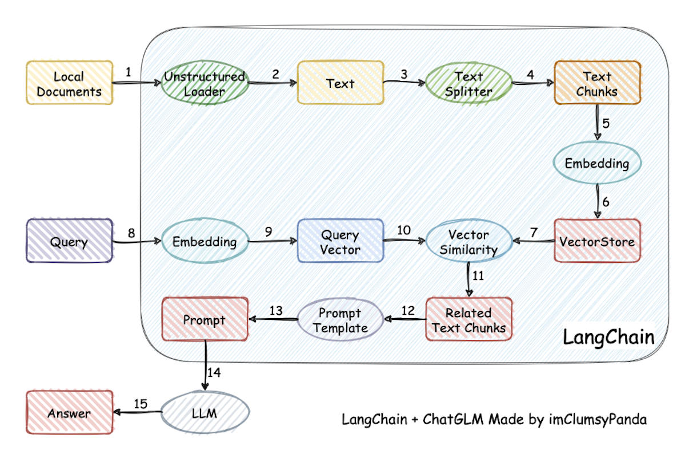


#### 微调 vs. RAG 该怎么选？

|  **对比维度**  | **微调（Fine-tuning）** | **RAG（检索增强生成）** |
|---------------|--------------------|-------------------|
| **适用场景** | 领域知识复杂、难以通过检索获取 | 需要引用最新信息、知识更新快 |
| **数据需求** | 需要大量高质量领域数据进行训练 | 只需构建高质量知识库 |
| **计算成本** | 训练成本高，推理时计算量大 | 训练成本低，推理时计算量适中 |
| **知识更新** | 需要重新微调 | 直接更新知识库即可 |
| **可解释性** | 生成内容基于训练数据，不易追溯来源 | 可提供检索到的文档作为依据 |

### **选择指南**
- **适合微调的情况**：
  - 知识较为稳定，不需要频繁更新。
  - 需要深度理解和推理，如医学诊断、法律推理。
  - 领域术语严格，不能容忍错误。
  - 训练数据足够丰富，可用于高质量微调。

- **适合 RAG 的情况**：
  - 需要引用最新的行业信息（如法规、论文、产品文档）。
  - 知识点分散在多个非结构化数据源中（如网页、PDF、数据库）。
  - 需要提供可溯源、可解释的答案。
  - 训练数据较少，无法支撑高质量微调。

- **微调 + RAG 结合使用**：
  - 领域基础知识用微调，提高模型对专业内容的理解。
  - RAG 用于实时获取最新信息，如企业知识库、法律法规。
  - 结合微调的模型，让 RAG 生成更精准、专业的内容。

### **总结**
- **微调适用于**：知识相对稳定、需要深入理解、无明确外部数据可用的场景。
- **RAG 适用于**：知识更新快、数据较分散、需要可解释性和溯源的场景。
- **微调 + RAG 结合**：当既需要专业能力又需要动态更新时，可以结合使用。


#### 垂直大模型产品

1. 法律大模型: 法律大模型具备提供基础的法律咨询，完成简单的法律专业文书写作等功能。[开源地址](https://github.com/PKU-YuanGroup/ChatLaw)
2. 医疗大模型: 医疗大模型能给人们进行问诊，并支持多模态的输入。[https://www.jiuyangongshe.com/a/dvb0030135](访问地址)
3. 教育大模型: 多邻国的教育大模型能提供语言学习上的支持，例如答案解析，学习内容规划等。[https://blog.duolingo.com/duolingo-max/](访问地址)
4. 金融领域大模型：金融领域大模型数量众多，基本的应用场景也围绕金融的日常工作，例如研报解读等。
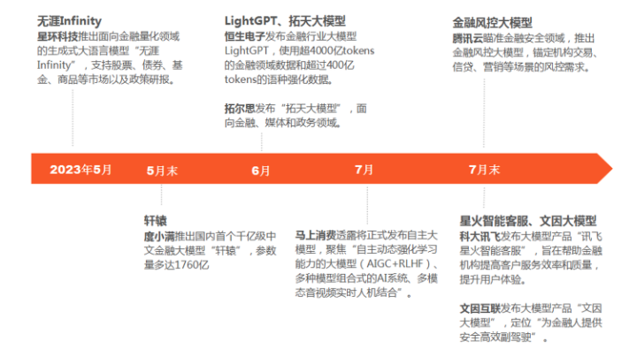
...

### AI Agent

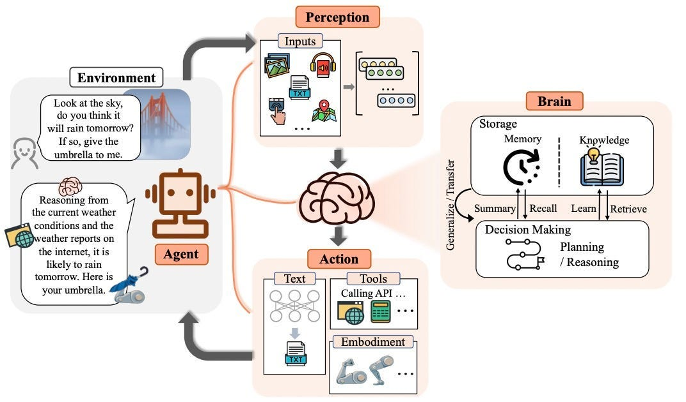

AI Agent 一般由大语言模型 (充当大脑), 调度/编排系统 (充当触发器和任务决策), 工具调用 (充当手脚), 记忆与学习 (充当经验), 多模态感知 (充当眼睛和耳朵) 等组成整。

#### 简易Agent

AI Agent 可以是极其简单的 prompt + LLM + 触发器组成, 比如一个中转英的翻译 Agent:

```
请帮我把下面的文本翻译为英文: {text}

（text 是用户输入的文本, 会由触发器自动拼进去）
```

#### 复杂Agent

下面则是 refly.ai 中一个给定命题, 自动搜索并生成文章的 AI Agent 的示例:

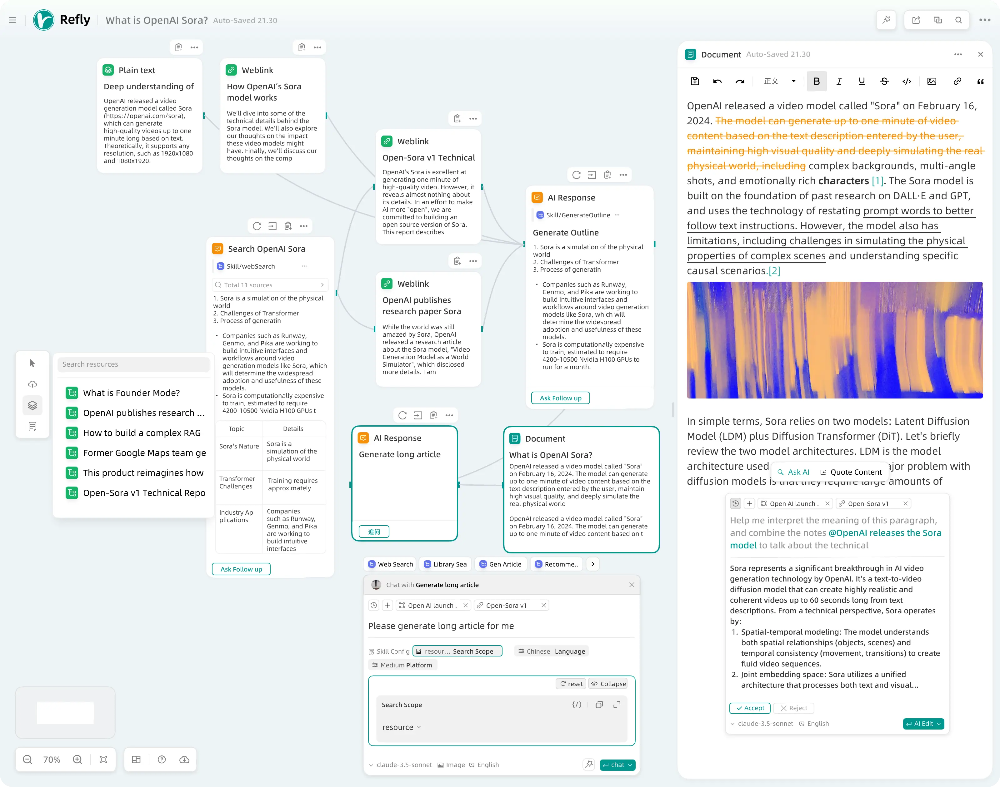

## 参考资料

+ https://zhuanlan.zhihu.com/p/375549477
+ https://news.skhynix.com.cn/all-about-ai-the-origins-evolution-future-of-ai/
+ https://github.com/chatchat-space/Langchain-Chatchat
+ https://leovan.me/cn/2020/05/introduction-of-reinforcement-learning/
+ https://www.woshipm.com/share/6091526.html
+ https://zhuanlan.zhihu.com/p/67206089
+ https://zhuanlan.zhihu.com/p/338817680
+ https://uee.ai/675/%E3%80%90%E7%A7%91%E6%99%AE%E3%80%91%E5%A4%A7%E6%A8%A1%E5%9E%8B%E5%BA%94%E7%94%A8%E4%B8%AD%E4%B8%80%E4%B8%AA-token-%E5%8D%A0%E5%A4%9A%E5%B0%91%E6%B1%89%E5%AD%97%EF%BC%9F%E7%AD%94%E6%A1%88%E8%B6%85/
+ https://github.com/deepseek-ai/DeepSeek-R1
+ https://blog.cnbang.net/tech/4160/
+ https://www.promptingguide.ai/zh
+ https://zhuanlan.zhihu.com/p/648018011
+ https://zhuanlan.zhihu.com/p/652645925
+ https://github.com/karminski/one-small-step/tree/main
