> 作者 黄浩楠

## 一、前言

电影《钢铁侠》中的AI管家——贾维斯相信都给大家留下了深刻的印象，尤其是当贾维斯叫醒女主人起床那一幕。而现在我们已经可以实现给自己家中部署一个像贾维斯那样的AI管家，想象一下早上是在小爱同学的呼唤中醒来，并为你播报实时的天气预报，与此同时窗帘自动打开，提高卧室亮度；晚上下班回家开门后灯光自动点亮。曾经只在科幻电影出现的场景，现在已经可以在现实生活中实现。

  

目前国内智能家居平台发展地如火如荼，但是每家公司都有自己的战略布局，都想将用户绑架到自己的生态，对于普通用户以及开发者十分不友好。例如，天猫精灵AI联盟里面买的东西但还是只能用天猫精灵控制，也就是从自家的app里面添加外别无他法；华为仅打造自家设备以及加入HiLink联盟的设备的万物互联，生态闭源，仅能在自家的华为健康生活中控制设备以及查看设备记录的数据。因此，为了将众多不同品牌的智能家居设备整合到一起，实现`all in one`的目的，则需要用到笔者将要介绍的第三方的开放平台——`Home Assistant`。

  

## 二、HA介绍

### 详情介绍

`HomeAssistant`是一个成熟完整的基于Python的智能家居系统，设备支持度高，支持自动化（`Automation`)、群组化（`Group`）、UI 客制化（`Theme`) 等等高度定制化设置。同样实现设备的 `Siri` 控制。基于`HomeAssistant`，可以方便地连接各种外部设备（智能设备、摄像头、邮件、短消息、云服务等，成熟的可连接组件有近千种），手动或按照自己的需求自动化地联动这些外部设备，构建随心所欲的智慧空间。`HomeAssistant`是免费开源软件，重点关注本地控制和隐私，因此无需担心个人隐私泄露问题。


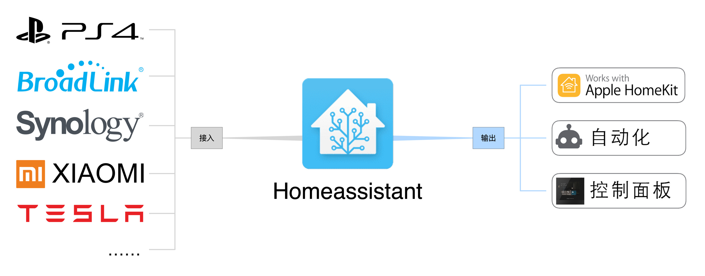

  

### 可玩方向

1. Home Assistant + Home Kit 实现米家等原生不支持`Home Kit`的设备接入`Home Kit`，实现在`apple`的家庭`app`中控制设备。

2. Home Assistant + Node Red 实现高度定制化的自动化操作。

3. Home Assistant + chat-gpt + 小爱音箱 实现个人的家庭语音助理，得益于chatgpt的强大之处，这个方向可玩性非常大。

4. ……

  

## 三、HA安装

> 关于Home Assistant的部署搭建有众多方式，每种方式有或多或少的坑。本教程只能尽可能地排除笔者的这条部署路径上的遇到的坑，其他部署路径遇到问题还请读者自行解决。

> 笔者安装选择如下图：


> 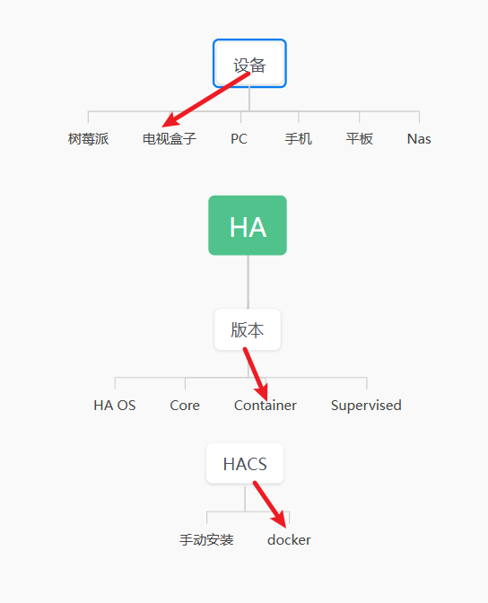

### 1.安装准备

`HomeAssistant`可安装在任何机器上，NAS、软路由、树莓派、PC，甚至安卓系统的手机、平板、电视盒子均可以。由于需要24小时开机，所以建议选择功耗较低的设备来运行。

  

### 2.安装方式

`HomeAssistant`有四种安装形式，分别是`Home Assistant Operating System`（操作系统）、`Home Assistant Container`（容器）、`Home Assistant Core`（核心）、`Home Assistant Supervised`（监管）。安装难度为`OS = Container < Core < Supervised`，官方推荐使用`OS`或者`Container`两种方式来进行安装。

四种方式的简要介绍如下：

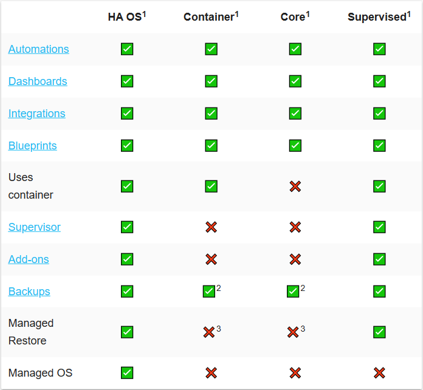

  

### 3.安装步骤

> 本文中笔者采用电视盒子+容器的方式来安装`Home Assistant`,读者可自行选择适合的设备安装部署。

#### 1.为电视盒子安装CasaOS

##### 介绍

`CasaOS`是一个基于`Docker`生态系统的开源家庭云系统，专为家庭场景而设计。致力于打造全球最简单、最易用、最优雅的家具云系统。

> 支持一键安装各类 NAS / 家庭智能应用，可快速在本地搭建与托管电影、音乐、游戏等家庭娱乐服务。`CasaOS` 里面的主要功能实现是通过 `docker` 应用，里面已经集成一些常用应用的 `docker`。

  

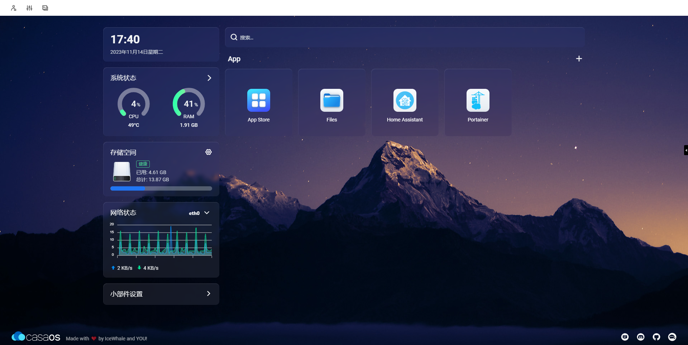

官方网站：https://casaos.io/

  

项目地址：https://github.com/IceWhaleTech/CasaOS

##### 安装

使用`ssh`工具连接至电视盒子，输入命令：

```

wget -qO- https://get.casaos.io | bash

```

或者

```

curl -fsSL https://get.casaos.io | bash

```

安装完成后，脚本会启动服务，并监听在80端口上。可在浏览器上输入http://你的IP进行访问。首次进入点击开始后，会提示创建账户：

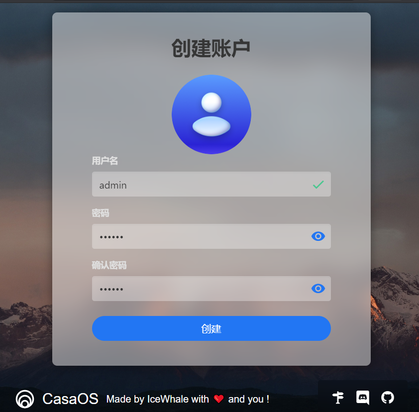

创建完账户后就会进入主界面：

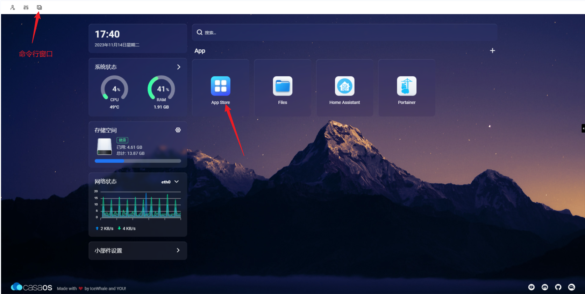

该系统提供了一个命令行窗口方便用户进行维护操作。另外，该系统还自带应用商店，里面包含了常见的一些`docker`应用，同时也可以自行安装自定义`docker`应用。

  

#### 2.安装Home Assistant的docker镜像

这里建议新手直接在`CasaOS`自带的`App Store`中进行图形化的安装；当然也可以直接使用`docker`命令进行安装。**本文仅探讨如何使用`docker`安装`HomeAssistant`容器，关于`docker`的安装及使用请读者查阅其他资料。**

  

使用`docker`安装步骤：

1. 查找镜像

```

docker search home-assistant

```

执行这条命令后的结果为：

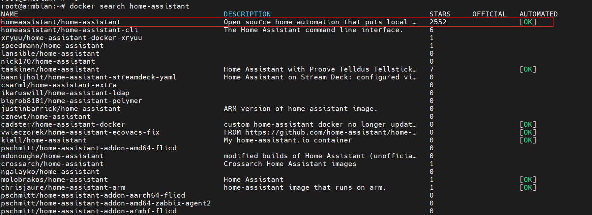

可以看到上图中被圈起来且排在第一的`homeassistant/home-assistant`

  

2. 下载镜像

```

docker pull homeassistant/home-assistant:latest

```

文件较大，下载过程久，请耐心等待。如果要下载其他版本的`homeassistant`，可参考[链接](https://hub.docker.com/r/homeassistant/home-assistant/tags)

  

3. 运行并创建容器

```

docker run -d --name="home-assistants" -v /[你的本地存放该容器配置路径]:/config -p 8123:8123 homeassistant/home-assistant

```

运行成功后会生成一串容器`ID`。切记！该命令操作一次，停止或启动（重启）请查看下面的步骤。

  

解释一下该命令的参数：

  

-d:表示在后台运行

  

–name：给容器设置别名（不然会随机生成，为了方便管理）

  

-v：配置数据卷（容器内的数据直接映射到本地主机环境，参考路径配置：-p /data/homeassistant/config ）

  

-p：映射端口（容器内的端口直接映射到本地主机端口）

最后便是刚才下载的镜像了，运行该容器。

  

4. 查看运行状态

```

docker ps

```

运行该命令后会看到容器的具体运行情况：

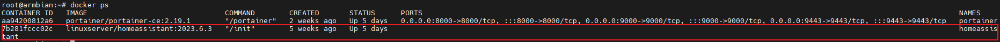

红色框中便是`HomeAssistant`容器，解释一下具体展示的信息：

  

| 名称      | 含义 |

| ----------- | ----------- |

| CONTAINER ID      | 容器ID       |

| IMAGE             | 使用的镜像名称        |

| COMMAND           | 启动容器时运行的命令        |

| CREATED           | 创建时间        |

| STATUS            | 容器状态        |

| PORTS             | 容器的端口信息和使用的链接类型(tcp\udp)        |

| NAMES             | 自动分配的容器名称        |

  

直接在浏览器中输入：你的IP:8123，即可进入`Home Assistant`的配置界面。

5. 停止或启动（重启）

使用`docker run`命令创建运行容器后，可以用一下命令来进行容器的停止和重启操作。

停止容器:

```

docker stop home-assistant

```

启动容器:

```

docker start home-assistant

```

#### 3.注册并登录Home Assistant

在浏览器中输入:你的IP地址:8123，首次进入`HomeAssistant`管理界面将会看到这个页面：

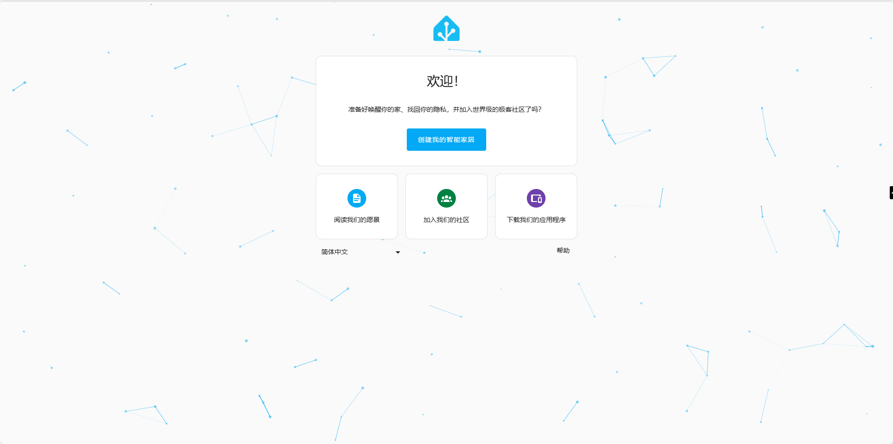

点击创建我的智能家居，进入创建账户界面：

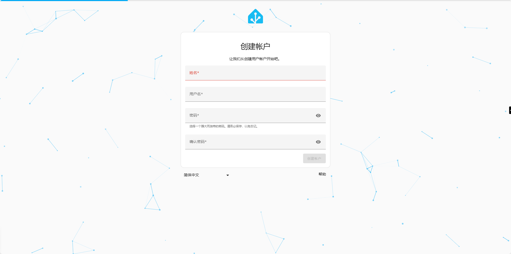

创建完账户会让你选择家所在的具体位置，这里直接选择自己家所在的位置就好；然后下一步是数据的分享请求，这里根据个人需要选择。

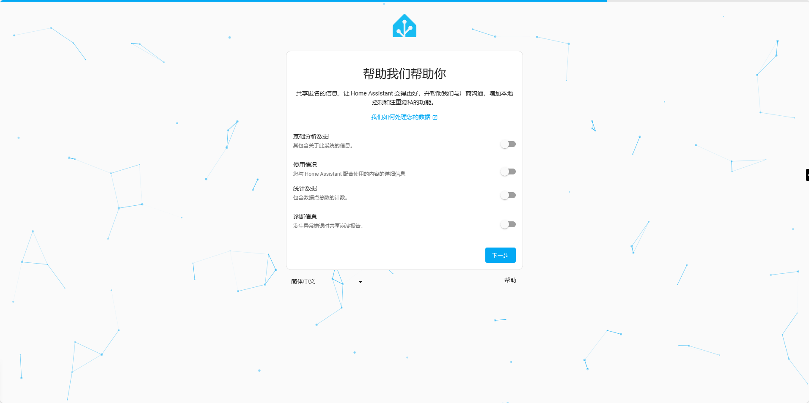

点击下一步后会显示以下界面，直接点击完成。

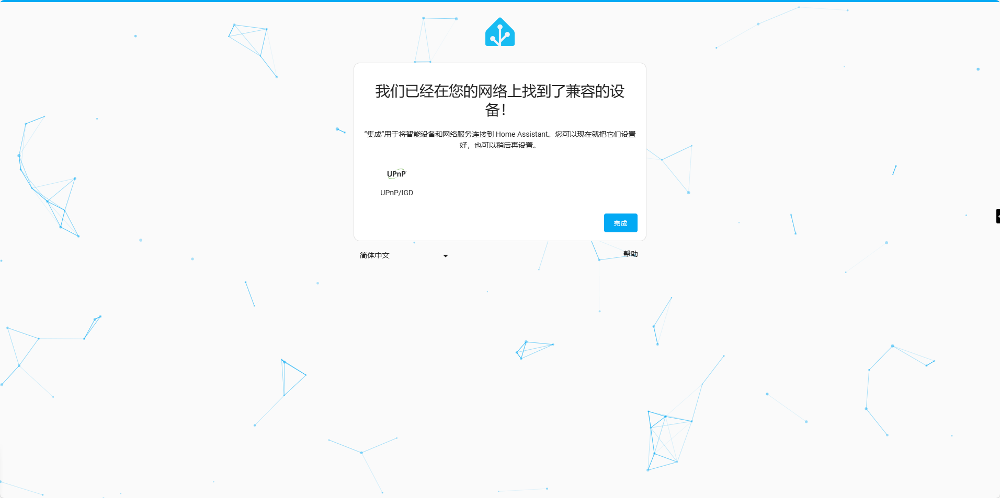

然后就可以看到配置完成的`HomeAssistant` web界面:

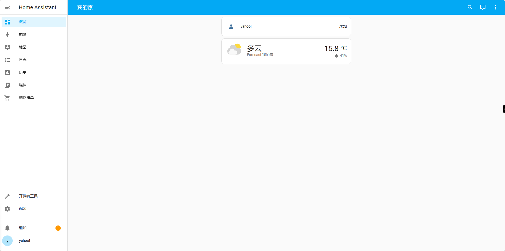

到这里`Home Assistant`就已经部署成功。最基础的平台已经搭建完成，后续只需要在`Home Assistant`上添加适合的插件即可将设备接入`Home Assistant`平台，展示设备的实时状态以及控制。

  

## 四、HACS安装

`HACS`即`Home Assistant`社区商店（`Home Assistant Community Store`），提供了一个强大的用户界面来处理所有自定义需求的下载。通过`HACS`可安装第三方集成和`Hass`主题。但是国人想要使用它下载插件或前端卡片却很困难，主要原因就是国内的网络环境。于是这里笔者选择了在国内安装更快的[HACS极速版](https://gitee.com/hacs-china)。作者说明如下：

> 本项目是HACS官方集成的修改版，安装本项目版本会覆盖官方的集成，但是无需重新配置集成(共用一套配置)，因此你可以放心安装。如果想切换到官方版本，使用官方的shell命令再安装即可。

  

【注意】安装`HACS`需要`GitHub`账号，请提前备好。

  

### 使用命令行安装（推荐）

#### 1.安装HACS

```

wget -O - https://hacs.vip/get | HUB_DOMAIN=ghps.cc/github.com bash -

```

本文安装`docker`版本的`HA`，需`ssh`登录到宿主机，使用`docker`命令进入到容器内部，`cd`进入到`HA`的配置目录中执行安装命令。

  

>linux（docker手动拉取镜像运行）  

安装目录（容器）：/usr/src/homeassistant/homeassistant  

配置目录（容器）：/config  

  

安装完成后会提示重启`Home Assistant`,如下图：

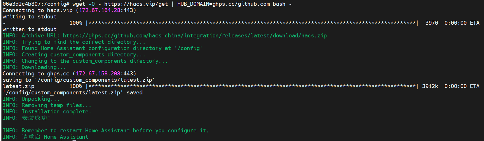

然后进入`ha`的`web`界面进行重启：

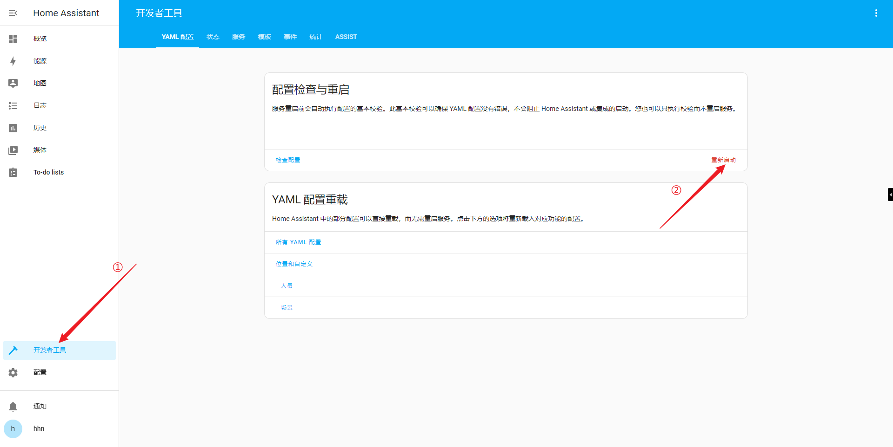

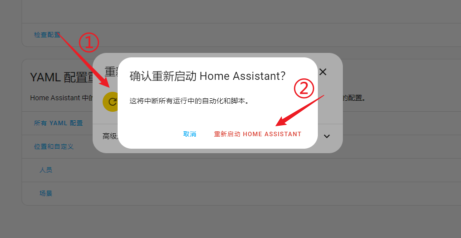

等待片刻后，`ha`重启完成就可以添加`HACS`集成了。

按照下图中操作来添加`HACS`集成：

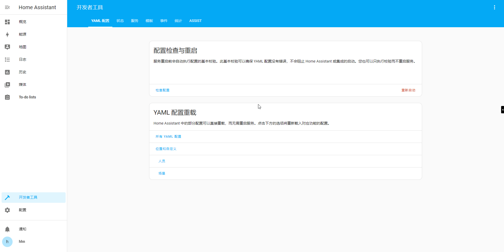

#### 2.申请GitHub授权：

>因为ha的生态圈非常活跃，很多开发者都会将写好的插件上传至GitHub，所以HACS的存在就可以通过Github的授权后下载众多插件。

  

1. 直接点击链接进入`GitHub`授权界面

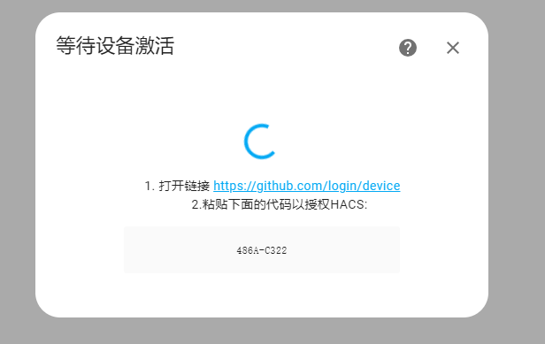

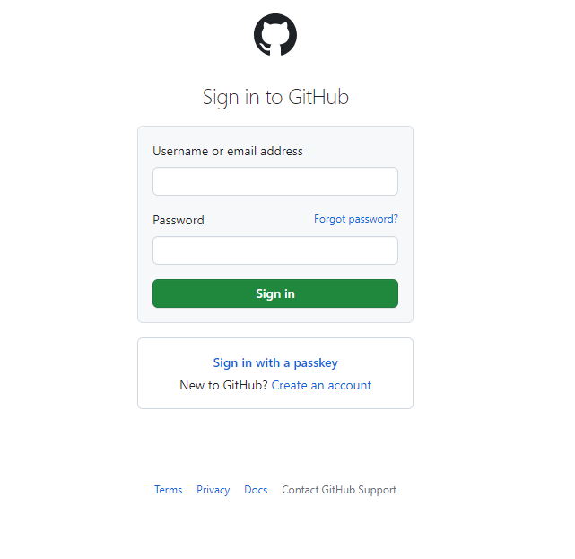

  

2. 登陆后输入`ha`提供的8位代码，点击`Authorize hacs`

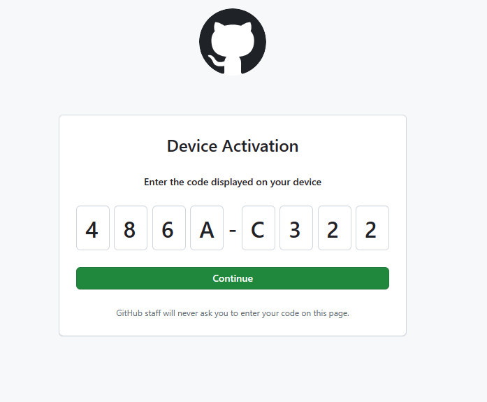

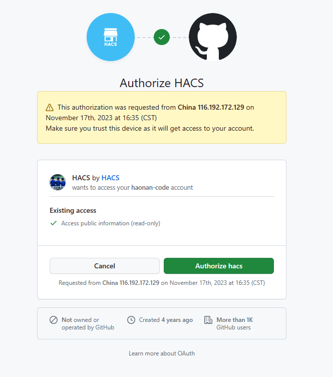  

出现下列图片时说明授权成功:

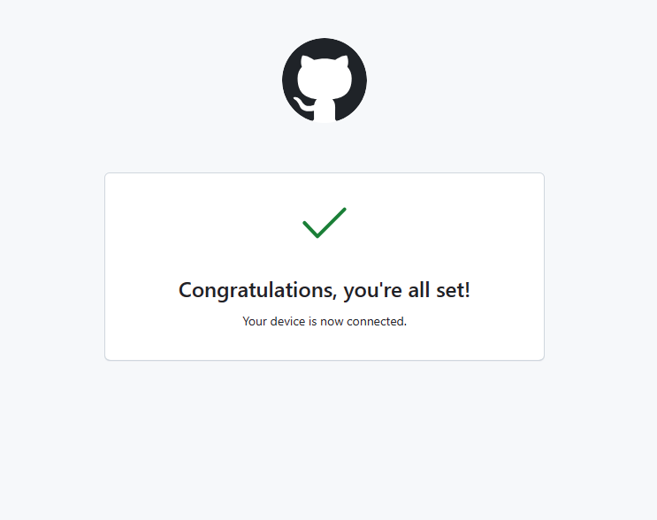


  

3. 左侧菜单栏出现`HACS`选项，可在其中搜索`GitHub`上的插件安装

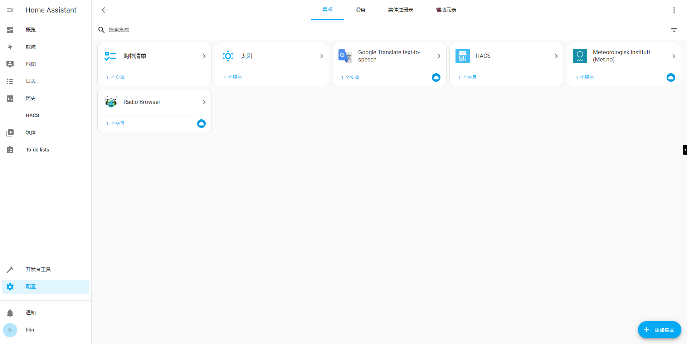

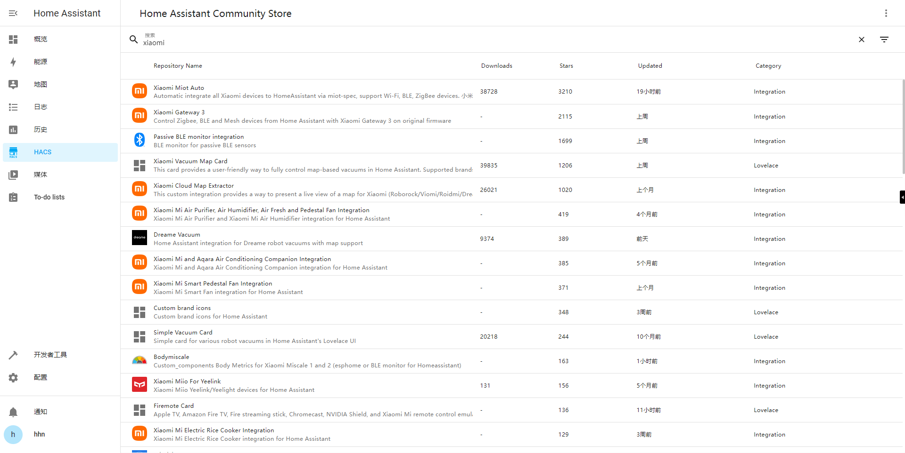

  

## 五、添加设备（米家设备为例）

国内智能家居领域各大厂商目前都在圈地自盟，厂商之间都只想将用户绑架在自己的生态圈，而作为消费者肯定是不想被某一个品牌绑架，但是不同品牌的设备怎么统一调度，国内并没有一个平台可以做到。而`HA`的出现打破了这个局面，它能够实现不同品牌设备的接入，从而统一调度。国内目前在智能家居领域占据较大市场的还是属于米家系列，小米丰富的生态与开放的原则吸引了众多消费者进入米家生态。所以本篇文章就以发展规模最大的米家设备入手，详细介绍如何将米家设备接入HA平台。

### 添加过程：

首先安装一个[Xiaomi Miot Auto](https://github.com/al-one/hass-xiaomi-miot/blob/master/README_zh.md)插件,该插件利用了`miot`协议的规范，可较为轻松地将小米设备接入`HA`平台。

  

1. 安装Xiaomi Miot Auto插件

点击左侧`HACS`栏，进入`HA`社区商店，搜索`xiaomi`，找到`Xiaomi Miot Auto`插件点击进入详情页面。

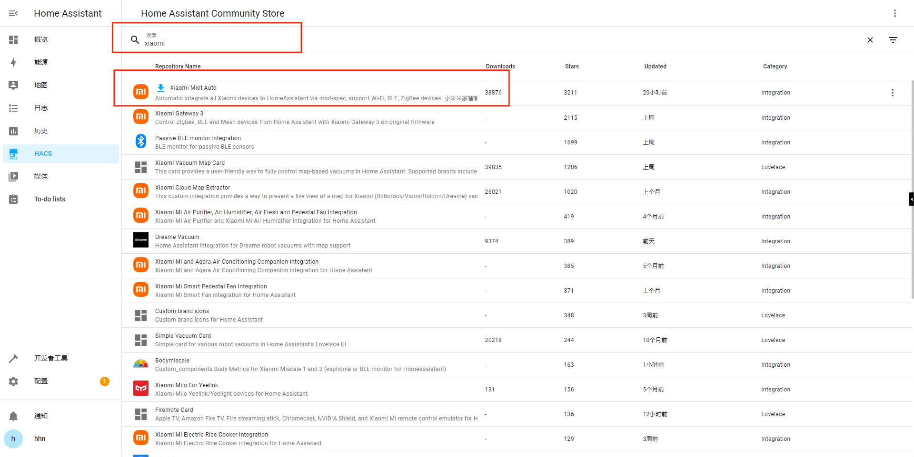

然后点击右下角`Download`按钮(笔者这里提前安装过，所以并未显示`Download`按钮)

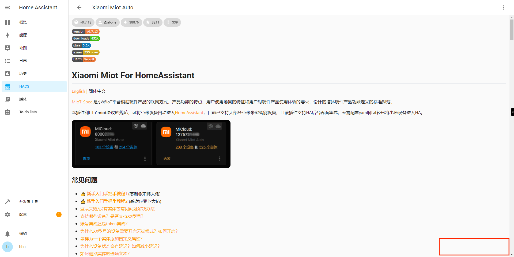

  

2. 重启设备

在HA中每安装一个新的插件，系统都会要求重启。插件下载完成后，左侧配置栏便会出现一个角标，点击进去系统会提示需要重启，按照提示点击即可。

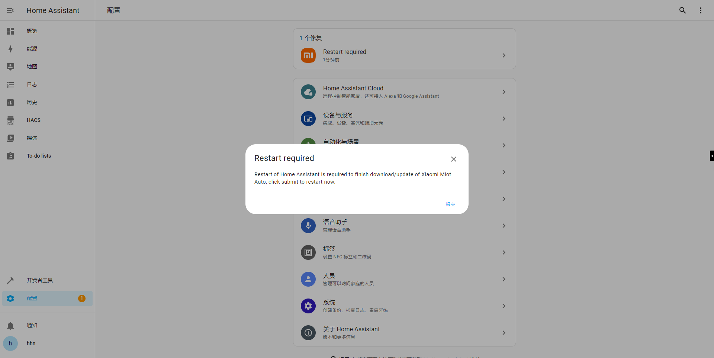

  

3. 添加集成

重启之后点击配置，然后添加集成，搜索`xiaomi`

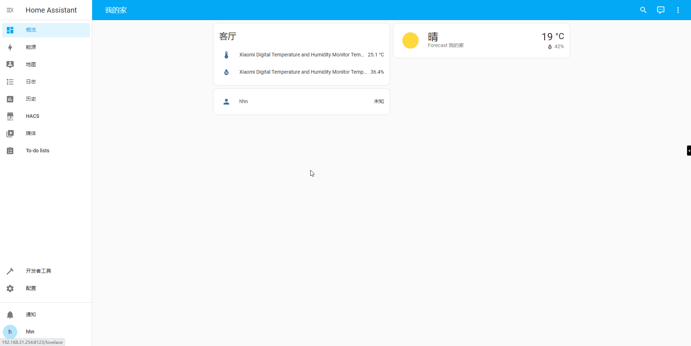

找到`xiaomi Miot Auto`,并点击

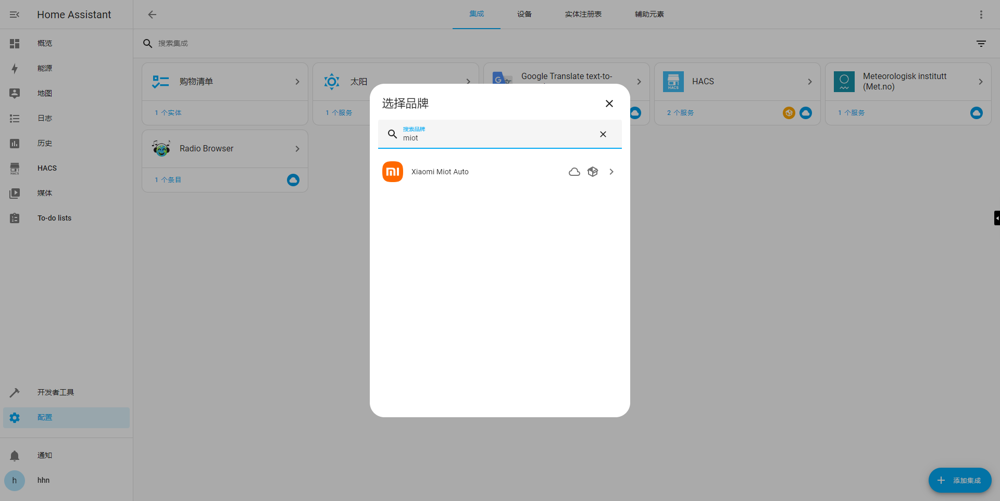

  

4. 登录小米账户，筛选并添加设备

接下会弹出选择操作的窗口，这里我们选择账号集成

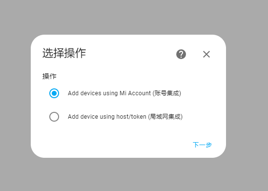

  

然后在接下来的窗口中登录小米账户，设备连接模式建议新手直接选择自动模式。

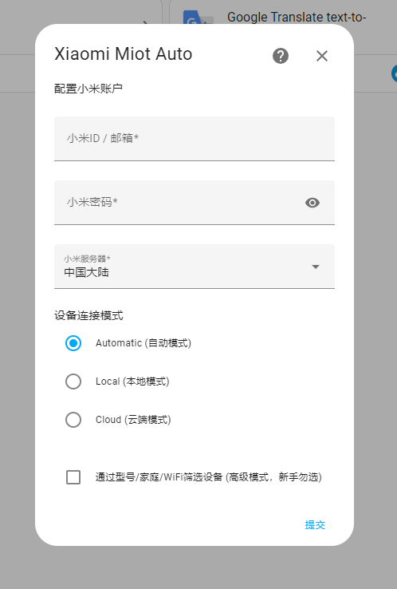

  

登录小米账号后即可筛选账号下的米家设备，这里选择自己想添加的设备即可。

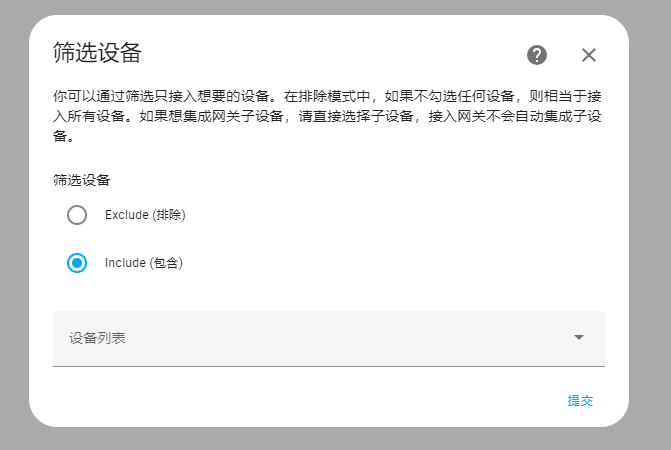

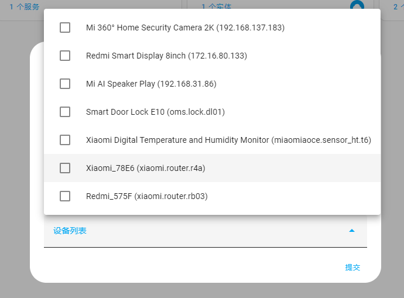

  

点击提交后出现以下界面说明设备添加成功。

  

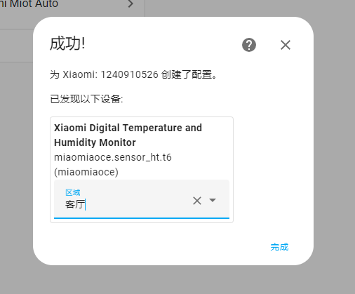

  

5. 添加至仪表盘

  

设备添加完成后，就可以将设备记录的信息展示至首页——仪表盘。

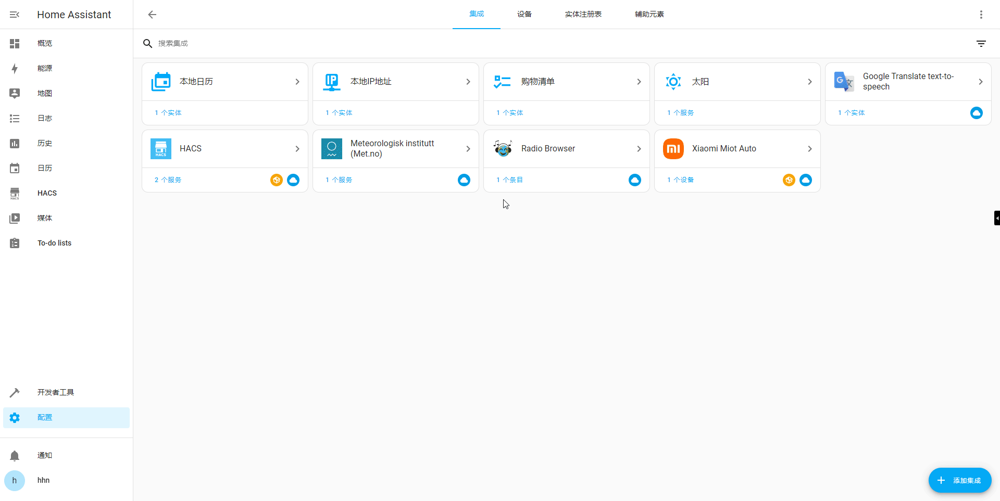

  

### 概览示例：

`Home Assistant`平台有众多组件和卡片，还可以安装开源的组件卡片，打造自己专属的仪表面板。以下是笔者大致整理后的仪表面板，读者可以作为参考，在此基础上创造出更好看的个性化仪表面板。

  

仪表示例：

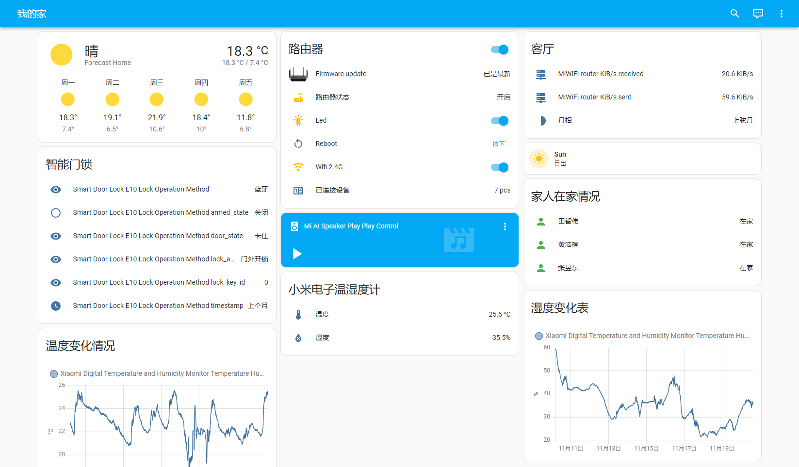

  

## 六、总结

`Home Assistant`还有众多玩法，比如通过HA将众多设备接入`Apple`的`Home Kit`平台、通过`HA`+`Node-Red`的方式实现高度定制化的自动化需求等等。笔者的介绍仅仅是冰山一角，只是抛砖引玉。希望有兴趣的小伙伴可自行探索出更多有趣的玩法。

  

总的来说，`Home Assistant`是一个可以打通不同品牌设备之间壁垒的平台，并一举打破了国内设备厂商圈地自盟的尴尬境地。与此同时，HA平台还汇聚了一众热爱编程的独立开发人员以及智能家居爱好者，正是靠着这一帮人的为爱发电，`Home Assistant`平台才能发展到如今的规模。感谢平台开发人员以及独立开发者们的不懈努力，让我们能够打造独属于自己的家庭中枢，并且注重个人数据与隐私安全，进一步感受科技带给生活的便捷性。

  

## 七、推荐资料

1. Home Assistant官方网站 https://www.home-assistant.io/

2. Home Assistant民间论坛 https://bbs.hassbian.com/

3. Home Assistant新手问题集 https://ljr.im/articles/home-assistant-novice-question-set/