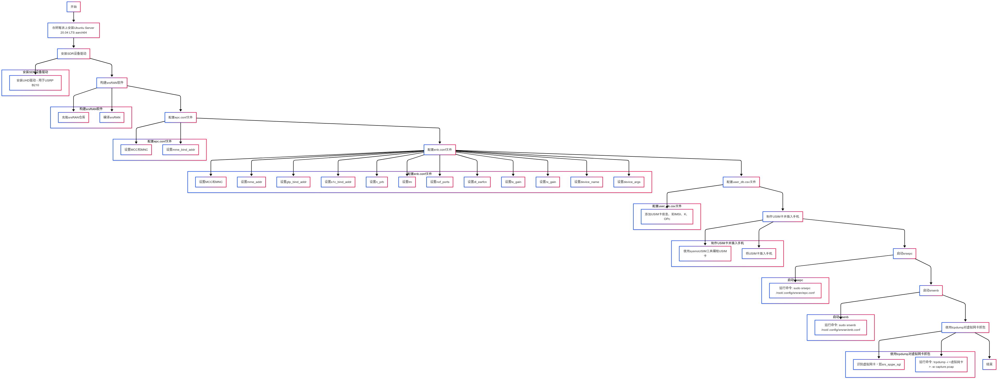

> 作者：黄浩楠
## 一、原理介绍
**伪基站通常由简易无线设备和专用开源软件组成，它可以通过模拟目标基站，依据相关协议向目标终端发送信令，获取目标终端相关信息。** 如下图所示，在目标基站的覆盖范围内，伪基站可以迫使目标终端小区重选、位置更新以及切换，从而达到网络诈骗、隐私信息获取等目的。


**本实例中通过搭建开源项目 srsRAN 建立 srsepc（LTE核心网络）和 srsenb（LTE eNodeB 基站），使用 blade B210 sdr 硬件设备提供47MHz和6GHz频率范围全双工通信，与 srsenb 共同搭建 4G 伪基站与终端设备进行数据通信；通过自行制作 USIM 卡解决运营商与 SIM 卡之间的双向认证问题，方便建立伪基站与终端设备的双向通信。默认情况下，部署的 srsRAN 核心网是一个独立的、隔离的网络，连接到 srsEPC 基站（srsENB）的用户设备可以相互通信，但无法直接访问互联网。本实例中，借助 srsRAN 自带的 shell 脚本`/usr/local/bin/srsepc_if_masq.sh`，启用 IP 转发和配置 iptables 的 IP 伪装，可将 srsRAN 核心网的流量路由至互联网，使得用户设备可以通过自行搭建的核心网和伪基站访问互联网。由于核心网启动后会创建 `srs_spgw_sgi` 虚拟网卡，故可在 Linux 系统下使用 `tcpdump` 命令直接对 `srs_spgw_sgi` 虚拟网卡进行抓包分析，进而获取到与设备进行通信的服务器 IP 地址。**


## 二、流程图




## 三、搭建步骤介绍
### 1. 在树莓派设备上构建 srsRAN 软件
#### 树莓派安装 Ubuntu  22.04.4 LTS aarch64 系统
#### 安装 USRP B210 SDR 设备驱动
- 给 SDR 设备安装相应的驱动：
	由于本项目中使用的是盗版b210，固无法使用通过 apt 下载的 uhd 自带的固件，需拷贝盗版 sdr设备的固件`usrp_b210_fpga.bin` 替换至 `usr/share/uhd/images`
```
# 安装 uhd 驱动
apt install libuhd-dev libuhd4.6.0 uhd-host 
/usr/lib/uhd/utils/uhd_images_downloader.py 
uhd_usrp_probe
```
安装成功执行 `uhd_usrp_probe`会出现详细设备信息说明驱动安装成功：

#### 构建 srsRAN 软件
- 安装编译运行 srsRAN 的开发库
```
apt install libfftw3-dev libmbedtls-dev libboost-program-options-dev libconfig++-dev libsctp-dev
```
- 克隆 srsRAN 仓库
```
git clone https://github.com/srsran/srsRAN.git
```
- 编译安装 srsRAN
```
cd srsRAN
git checkout tags/release_19_12
mkdir build && cd build
cmake ../
make -j4
make install
ldconfig
```
若在执行 `cmake ../` 命令时，遇到将编译器警告视为错误的情况，可尝试去掉 `-Werror`编译选项
打开`CMakeLists.txt`文件，查找下列代码行：
```
set(CMAKE_CXX_FLAGS "${CMAKE_CXX_FLAGS} -Werror")
set(CMAKE_C_FLAGS "${CMAKE_C_FLAGS} -Werror")
```
去掉 `-Werror` 编译选项，即可在生成 Makefile 时忽略掉编译器警告
```
set(CMAKE_CXX_FLAGS "${CMAKE_CXX_FLAGS}")
set(CMAKE_C_FLAGS "${CMAKE_C_FLAGS}")
```

- 创建 srsRAN 4G 配置环境
```
./srsran_4g_install_configs.sh user
```

### 2. 配置 epc.conf 、enb.conf、user_db.csv 文件
#### srsepc 配置 epc.conf 文件
作用：`epc.conf` 文件用于配置 LTE 网络的核心网部分，即演进分组核心网 (EPC)。EPC 负责处理用户设备的移动性管理、会话管理、承载管理、用户认证、策略控制和计费等核心功能。`epc.conf` 文件包含了 EPC 中各个网络实体（如 MME, S-GW, P-GW, HSS）的通用配置参数。

- 打开配置文件：`/root/.config/srsran/epc.conf`
- 配置下列参数：
	- 设置 `MCC`（移动国家代码，标识网络所在国家） 和 `MNC`（移动网络代码，标识运营商）
```
# 替换为自行制作的 USIM 卡的信息
mcc = 460 
mnc = 11
```

#### srsenb 配置 enb.conf 文件
作用：`enb.conf` 文件用于配置 LTE 网络中的基站，即演进型 NodeB (eNodeB 或 eNB)。eNB 负责无线资源管理、用户数据调度、移动性管理以及与用户设备 (UE) 和 EPC 的连接。`enb.conf` 文件包含了 eNB 的无线参数、传输参数、以及与 EPC 连接相关的配置。

- 打开配置文件：`/root/.config/srsran/enb.conf`
- 设置以下关键参数：
    - `mcc` 和 `mnc`（与epc.conf一致）
    - `dl_earfcn` 更改为制作的 USIM 对应的基站运营商的频率

#### 配置user_db.csv 文件
作用：`user_db.csv` 文件通常用作一个简化的用户数据库，用于存储用户的身份验证和授权信息。在一些小型或实验性的 LTE 网络部署中，为了简化配置，可能会使用 CSV 文件来代替更复杂的 HSS (Home Subscriber Server) 或 AuC (Authentication Center) 系统。 这个文件通常包含用户设备 (UE) 的 IMSI (国际移动用户识别码)、密钥以及其他认证参数。

- 打开文件：`/root/.config/srsran/user_db.csv`
- 添加制作的 USIM 卡信息
```
# .csv ⽂件⽤于在 HSS 中存储⽤户设备（UE）的信息 
# 以以下格式保存："Name,Auth,IMSI,Key,OP_Type,OP/OPc,AMF,SQN,QCI,IP_alloc" 
# 
# Name: ⽅便识别 UE 的可读名称。HSS 会忽略该字段 
# Auth: UE 使⽤的认证算法。有效算法为 XOR (xor) 和 MILENAGE (mil) 
# IMSI: UE 的 IMSI 值 
# Key: UE 的密钥，其他密钥由此派⽣。以⼗六进制存储 
# OP_Type: 运营商代码类型，OP 或 OPc 
# OP/OPc: 运营商代码或加密的运营商代码，以⼗六进制存储 
# AMF: 认证管理字段，以⼗六进制存储 
# SQN: UE 的序列号，⽤于确保认证的新鲜性 
# QCI: UE 默认承载的服务质量类别标识符 
# IP_alloc: SPGW 的 IP 分配策略。 
#           选择 'dynamic' 时，SPGW 将⾃动分配 IP 地址 
#           使⽤有效的 IPv4 地址（如 '172.16.0.2'）时，UE 将被分配静态 IP。 
# 
# 注意：以 '#' 开头的⾏将被忽略，并可能被覆盖 ue2,mil,460110000000001,00112233445566778899aabbccddeeff,opc,63bfa50ee6523365ff14c1 f45f88737d,8000,000000001234,7,dynamic
```


### 3. 制作 USIM 卡
#### [USIM卡制作](USIM卡制作.pdf)

### 4. 启动 srsepc 和 srsenb
#### 将核心网路由到互联网中
`eth0`为设备连接互联网的网络接口，若是通过 WiFi 连接，则应该更改为对应的 WiFi 网络接口
```bash
/usr/local/bin/srsepc_if_masq.sh eth0
```
#### 先启动核心网 srsepc（建议cd到/root/.config/srsran/目录下执行命令）
```bash
srsepc /root/.config/srsran/epc.conf
```

#### 然后再建立一个ssh连接，启动基站服务 srsenb（建议cd到/root/.config/srsran/目录下执行命令）
```bash
srsenb /root/.config/srsran/enb.conf
```

**手机若不能直接连接上伪基站，则需要开关飞行模式后让手机重新扫描基站信号，手机能够正常上网即说明连接成功**

### 5. 使用`tcpdump`对虚拟网卡进行抓包

srsepc 和 srsenb 服务启动后查看网络信息：


`srs_spgw_sgi`即为 srsepc 创建的虚拟网卡，手机上访问网页的请求均路由至该虚拟网卡
使用 `tcpdump -i srs_spgw_sgi` 命令即可对该虚拟网卡进行抓包：


## 参考
[伪基站协助物联网后台溯源](伪基站协助物联网后台溯源.pdf)
https://docs.srsran.com/projects/4g/en/latest/app_notes/source/pi4/source/index.html
